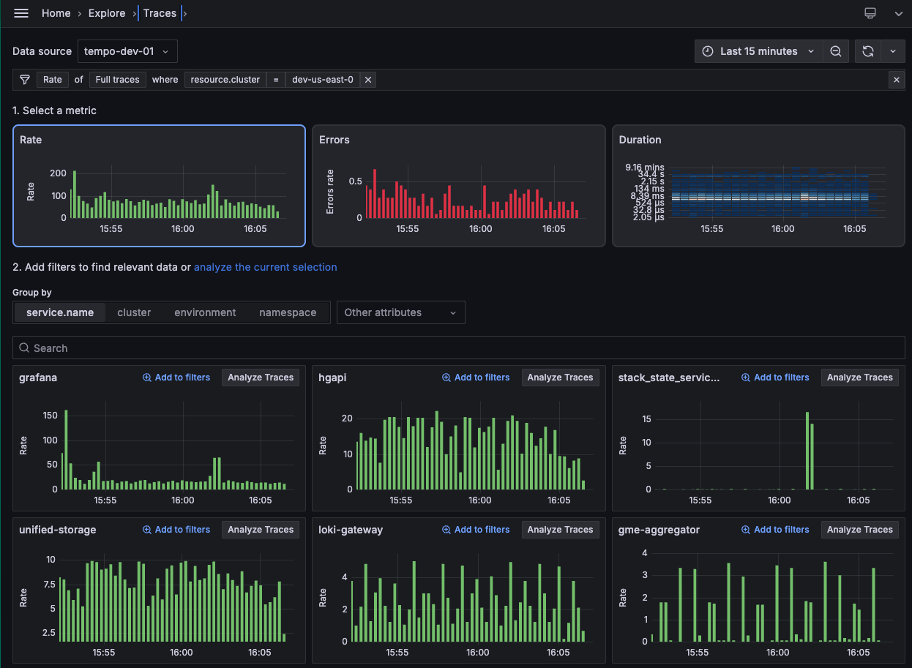

# Traces Drilldown

Distributed traces provide a way to monitor applications by tracking requests across services.
Traces record the details of a request to help understand why an issue is or was happening.

Tracing is best used for analyzing the performance of your system, identifying bottlenecks, monitoring latency, and providing a complete picture of how requests are processed.

Grafana Traces Drilldown helps you make sense of your tracing data so you can automatically visualize insights from your Tempo traces data.
Before this app, you would use [TraceQL](https://grafana.com/docs/tempo/latest/traceql/), the query language for tracing, to [construct a query](https://grafana.com/docs/grafana-cloud/send-data/traces/traces-query-editor/) in Grafana.

Note: The Explore Traces app is now called Traces Drilldown. To learn more, read [Grafana Drilldown apps: the improved queryless experience known as the Explore apps](https://grafana.com/blog/2025/02/20/grafana-drilldown-apps-the-improved-queryless-experience-formerly-known-as-the-explore-apps/). 

> [!IMPORTANT]
> Traces Drilldown is presently undergoing active development and is offered in a preview state. Subsequent updates are likely to incorporate significant changes that may impact existing functionality.



## Access or install Traces Drilldown

You can access Traces Drilldown using Grafana Cloud or a self-managed OSS Grafana or Grafana Enterprise.

The easiest way to access Traces Drilldown is in Grafana Cloud. No setup or installation is required.

To use Traces Drilldown with self-managed Grafana, you need to install the Traces Drilldown plugin.

### Grafana Cloud

To use Traces Drilldown, you need:

* A Grafana Cloud account
* A Grafana stack in Grafana Cloud with a configured Tempo data source receiving tracing data

To access Traces Drilldown:

1. Open your Grafana stack in a web browser.
1. In the main menu, select **Drilldown** > **Traces**.

### Grafana

To use Traces Drilldown with Grafana open source or Grafana Enterprise, you need:

- Your own Grafana instance
- A configured [Tempo data source](ref:tempo-data-source)
- The [Traces Drilldown plugin](https://grafana.com/grafana/plugins/grafana-exploretraces-app/)

#### Install the Traces Drilldown plugin

Traces Drilldown is distributed as a Grafana Plugin.
You can find it in the official [Grafana Plugin Directory](https://grafana.com/grafana/plugins/grafana-exploretraces-app/).

>**NOTE:** All Grafana Cloud instances come with the Traces Drilldown plugin preinstalled.

#### Install in your Grafana instance

You can install Traces Drilldown in your own Grafana instance using `grafana cli`:

```shell
grafana cli --pluginUrl=https://storage.googleapis.com/integration-artifacts/grafana-exploretraces-app/grafana-exploretraces-app-latest.zip plugins install grafana-traces-app
```

Alternatively, follow these steps to install Traces Drilldown in Grafana:

1. In Grafana, go to **Administration** > **Plugins and data** > **Plugins**.
2. Search for "Traces Drilldown".
3. Select Traces Drilldown.
4. Click **Install**.

The plugin is automatically activated after installation.

#### Install for a Docker container

If you want to install the app in a Docker container, you need to configure the following environment variable:

```shell
GF_INSTALL_PLUGINS=https://storage.googleapis.com/integration-artifacts/grafana-exploretraces-app/grafana-exploretraces-app-latest.zip;grafana-traces-app
```

## Learn more

To learn more about Traces Drilldown, refer to our documentation in [the repository](docs/sources/_index.md) or published in the [Grafana open source](https://grafana.com/docs/grafana/latest/explore/simplified-exploration/traces) documentation.

## Contribute

Want to help with the project? Read the [Contributor's guidelines](CONTRIBUTING.md) to learn more. 
