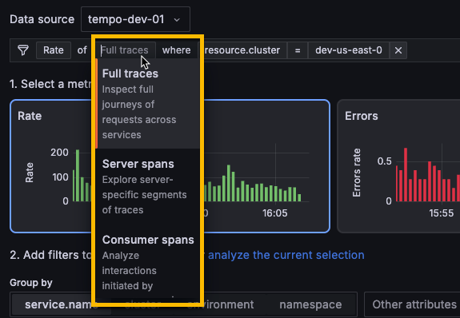
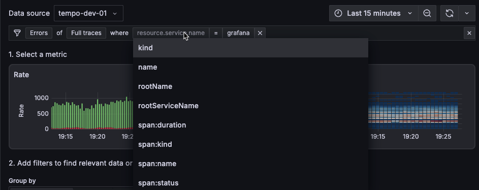

---
cascade:
  FULL_PRODUCT_NAME: Grafana Explore Traces
  PRODUCT_NAME: Explore Traces
description: Learn about traces and how you can use them to understand and troubleshoot
  your application and services.
canonical: https://grafana.com/docs/grafana/latest/explore/simplified-exploration/traces/
keywords:
  - Explore Traces
  - Traces
title: Explore Traces
menuTitle: Explore Traces
weight: 100
refs:
  tempo-data-source:
    - pattern: /docs/grafana/
      destination: /docs/grafana/<GRAFANA_VERSION>/datasources/tempo/
    - pattern: /docs/grafana-cloud/
      destination: /docs/grafana-cloud/connect-externally-hosted/data-sources/tempo/
---

# Explore Traces
<!-- Use this for the product name  -->



Distributed traces provide a way to monitor applications by tracking requests across services.
Traces record the details of a request to help understand why an issue is or was happening.

Tracing is best used for analyzing the performance of your system, identifying bottlenecks, monitoring latency, and providing a complete picture of how requests are processed.

Explore Traces helps you make sense of your tracing data so you can automatically visualize insights from your Tempo traces data.
Before this app, you would use [TraceQL](https://grafana.com/docs/tempo/<TEMPO_VERSION>/traceql/), the query language for tracing, to [construct a query](https://grafana.com/docs/grafana-cloud/send-data/traces/traces-query-editor/) in Grafana.

<!-- need new video  -->


Using the app, you can:

* Use Rate, Errors, and Duration (RED) metrics derived from traces to investigate issues
* Uncover related issues and monitor changes over time
* Browse automatic visualizations of your data based on its characteristics
* Do all of this without writing TraceQL queries

<!-- make live when the app is available in play.grafana
 -->

## Concepts

To use the Explore Traces app, you should understand traces, spans, RED metrics, and other concepts related to tracing.

This section provides an overview of some of these concepts and links to additional resources.

### Rate, error, and duration metrics

The Explore Traces app lets you explore rate, error, and duration (RED) metrics generated from your traces by Tempo.

| Metric | Meaning | Useful for investigating |
|---|---|---|
| Rate | Number of requests per second | Unusual spikes in activity |
| Error | Number of those requests that are failing | Overall issues in your tracing ecosystem |
| Duration | Amount of time those requests take, represented as a histogram | Response times and latency issues |

For more information about the RED method, refer to [The RED Method: how to instrument your services](https://grafana.com/blog/2018/08/02/the-red-method-how-to-instrument-your-services/).

### Traces and spans

A trace represents the whole journey of a request or an action as it moves through all the nodes of a distributed system, especially containerized applications or microservices architectures.
This makes them the ideal observability signal for discovering bottlenecks and interconnection issues.

Traces are composed of one or more spans.
A span is a unit of work within a trace that has a start time relative to the beginning of the trace, a duration, and an operation name for the unit of work.
It usually has a reference to a parent span, unless it’s the first span, the root span, in a trace.
It frequently includes key/value attributes that are relevant to the span itself, for example, the HTTP method used in the request, as well as other metadata such as the service name, sub-span events, or links to other spans.

For more information, refer to [Use traces to find solutions](https://grafana.com/docs/tempo/latest/introduction/solutions-with-traces/) in the Tempo documentation.

## Access or install Explore Traces

You can access Explore Traces using Grafana Cloud or a self-managed OSS Grafana or Grafana Enterprise.

The easiest way to access Explore Traces is in Grafana Cloud. No setup or installation is required.

To use Explore Traces with self-managed Grafana, you need to install the Explore Traces plugin.

### Grafana Cloud

To use Explore Traces, you need:

* A Grafana Cloud account
* A Grafana stack in Grafana Cloud with a configured Tempo data source receiving tracing data

To access Explore Traces:

1. Open your Grafana stack in a web browser.
1. In the main menu, select **Explore** > **Traces**.

### Grafana

To use Explore Traces with Grafana open source or Grafana Enterprise, you need:

- Your own Grafana instance
- A configured [Tempo data source](ref:tempo-data-source)
- The [Explore Traces plugin](https://grafana.com/grafana/plugins/explore-traces-app/)

#### Install the Explore Traces plugin

Explore Traces is distributed as a Grafana Plugin.
You can find it in the official [Grafana Plugin Directory](https://grafana.com/grafana/plugins/grafana-exploretraces-app/).


All Grafana Cloud instances come with the Explore Traces plugin preinstalled.


#### Install in your Grafana instance

You can install Explore Traces in your own Grafana instance using `grafana cli`:

```shell
grafana cli --pluginUrl=https://storage.googleapis.com/integration-artifacts/grafana-exploretraces-app/grafana-exploretraces-app-latest.zip plugins install grafana-traces-app
```

Alternatively, follow these steps to install Explore Traces in Grafana:

1. In Grafana, go to **Administration** > **Plugins and data** > **Plugins**.
2. Search for "Explore Traces".
3. Select Explore Traces.
4. Click **Install**.

The plugin is automatically activated after installation.

#### Install for a Docker container

If you want to install the app in a Docker container, you need to configure the following environment variable:

```shell
GF_INSTALL_PLUGINS=https://storage.googleapis.com/integration-artifacts/grafana-exploretraces-app/grafana-exploretraces-app-latest.zip;grafana-traces-app
```

## Investigate tracing data

Most investigations follow these steps:

1. Select the primary signal.
1. Choose the metric you want to use: rates, errors, or duration.
1. Define filters to refine the view of your data.
1. Use the comparison, structural or trace list to drill down into the issue.

### Example

For example, say that you want to figure out the source of errors in your spans.
You'll need to compare the errors in the traces to locate the problem trace.
Here's how this works.

First, you select **Full traces** as the signal type and then choose the **Errors** metric.
To correlate attribute values with errors, you can use the **Comparison** tab.
This tab surfaces attributes values that heavily correlate with erroring spans. 
The results are ordered by the difference in those attributes by the highest ones first which helps
you see what's causing the errors immediately.
This error shows that 99.34% of the time the span name was equal to `HTTP GET /api/datasources/proxy/uid/:uid/*`. The span was also erroring.


To dig deeper into this issue, select **Inspect** to focus in on the problem.
It's easy to spot the problem: the tall, red bar indicates that the problems are happening with  `HTTP GET /api/datasources/proxy/uid/:uid/*`.
Next, use **Add to filters** to focus just on the API call.


Selecting the **Root cause errors** tab shows an aggregated view of all of the traces that have errors in them.
To view additional details, you right-click on a line and select **HTTP Outgoing Request**.


Clicking on an entry opens up one of the individual traces used to construct that aggregate view so you can deep dive into a single example transaction.


### Change the primary signal type to observe

Tracing data is highly structured and annotated and reflects events that happen in your services.
You can choose the type of services you want to observe and think about.

You can use the full trace (trace roots), or you can select a more specific type, such as service or database calls.

By default, Explore Traces displays information about full traces. You can change this by using the selector in the Filter bar.



You can use any one of these primary signal types.

Full traces
: Inspect full journeys of requests across services

Server spans
: Explore service-specific segments of traces

Consumer spans
: Analyze interactions initiated by consumer services

Database calls
: Evaluate performance issues in database interactions

All spans
: View and analyze raw span data

### Choose a RED metric

Explore Traces uses RED metrics generated from your tracing data to guide your investigation.
In this context, RED metrics mean:

* **Rates** show the rate of incoming spans per second.
* **Errors** show spans that are failing.
* **Duration** displays the amount of time those spans take; represented as a heat map that shows response time and latency.

When you select a RED metric, the tabs underneath the metrics selection changes match the context.
For example, selecting **Duration** displays the **Breakdown**, **Root cause latency**, and **Slow traces tabs**.
Choosing **Errors** changes the tabs to **Breakdown**, **Root cause errors**, and **Errored traces**. Rate provides **Breakdown**, **Service structure**, and **Traces** tabs.
These tabs are used when you [compare tracing data](#compare-tracing-data).

To choose a RED metric:

1. Select a metric type a graph to select a **Rate**, **Errors**, or **Duration** metric type. Notice that your selection changes the first drop-down list on the filter bar.
1. Optional: Select the signal you want to observe. **Full traces** are the default selection.
1. Look for spikes or trends in the data to help identify issues.


If no data or limited data appears, refresh the page. Verify that you have selected the correct data source in the Data source drop-down as well as a valid time range.


### Define filters

Next, refine your investigation by adding filters.

Each time you add a filter, the condition appears in the list of filters at the top of the page.
The list of filters expands as you investigate and explore your tracing data using Explore Traces.

1. Refine your investigation by adding filters.
1. Optional: Choose one of the attributes to group by or use **Search** to locate the service.
1. Optional: Use the tabs underneath the metrics selection to provide insights into breakdowns, comparisons, latency, and other explorations.
1. Select filters to hone in on the problem areas. Each filter that you select adds to the Filter statement at the top of the page. You can select filters in the following ways:
    1. Select **Inspect**.
    1. Use the **Search** field.



#### Group by attributes

Using the **Group by** filter, you can group the selected metric by different attributes.
For example, if you have selected **Errors** as a metric type and then choose the `service.name` attribute, then the displayed results show the number of errors sorted by the `service.name` with the most matches.

The app defaults to `service.name` and displays other commonly used resource level attributes such as `cluster`, `environment`, and `namespace`.
However, in the drop-down list, you can choose any resource level attribute to group by.

You can use **Other** attributes to select a different attribute.

#### Modify a filter

Selecting an option for a filter automatically updates the displayed data. If there are no matches, the app displays a “No data for selected query” message.

To modify an applied filter:

1. Select the filter to modify in the Filter bar.
1. Select the value you want to filter by from the drop-down menu the opens up.

#### Remove one or more filters

You can remove all or individual filters.

To remove a filter, select **Remove filter** (**X**) at the end of the filter you want to remove.

To remove all filters, select **Clear filters** (**X**) from the right side of the Filter bar.

Selecting **Clear filters** resets your investigation back to the first metric you selected.
For example, if you selected Errors metrics and **Group by** the `host` service.name, selecting **Clear filters** resets the search back to just **Errors** selected as the metric type.

### Analyze tracing data

You can further analyze the filtered spans using the dynamically changing tabs, **Comparison**, **Structure**, and **Trace list**. 

When you select a RED metric, the tabs underneath the metrics selection changes match the context.

Each tab provides a brief explanation about the information provided.

#### Comparison

The **Comparison** tab highlights attributes that are correlated with the selected metric.
For example, if you're viewing **Error** metrics, then the comparison shows the attribute values that correlate with errors. However, if you're viewing **Duration** metrics, then the comparison shows the attributes that correlate with high latency.

The behavior of the comparison also differs depending upon the RED metric you've chosen.
For example, the **Breakdown** view shows the comparison results.
When you're using **Duration** metrics, **Breakdown** orders attributes by their average duration.
However, when you select **Rate**, **Breakdown** orders attributes by their rate of requests per second, with errors colored red.

#### Structure

The structural tab lets you extract and view aggregate data from your traces.

* Rate provides **Service structure**
* Errors provides **Root cause errors**
* Duration metrics provides **Root cause latency**

For **Rate**, the **Service structure** tab shows you how your applications "talk" to each other to fulfill requests.
Using this view helps you analyze the service structure of the traces that match the current filters.

For **Errors**, the **Root cause errors** tab shows structure of errors beneath your selected filters. You can use this tab to immediately see the chain of errors that are causing issues higher up in traces.


When you select **Duration** metrics, the **Root cause latency** tab shows the structure of the longest running spans so you can analyze the structure of slow spans.

The pictured spans are an aggregated view compiled using spans from multiple traces.

#### Trace list

Each RED metric has a trace list:

* **Rate** provides a tab that lists **Traces**
* **Errors** provides a list of **Errored traces**
* **Duration** lists **Slow traces**

## Change selected time range

Use the time picker at the top right to modify the data shown in Explore Traces.

You can select a time range of up to 24h hours in duration. This time range can be any 24h period in your configured trace data retention period (30 days by default).

For more information about the time range picker, refer to [Use dashboards](https://grafana.com/docs/grafana/latest/dashboards/use-dashboards/#set-dashboard-time-range).