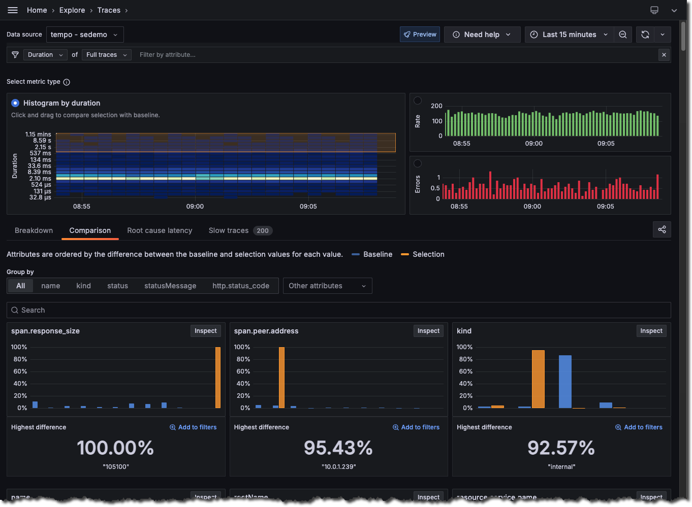

---
cascade:
  _build:
    list: false
  noindex: true
  FULL_PRODUCT_NAME: Grafana Explore Traces
  PRODUCT_NAME: Explore Traces
description: Learn about traces and how you can use them to understand and troubleshoot
  your application and services.
keywords:
  - Explore Traces
  - Traces
title: Explore Traces
menuTitle: Explore Traces
weight: 100
---

# Explore Traces
<!-- Use this for the product name  -->



Distributed traces provide a way to monitor applications by tracking records across services.
Traces make it possible to follow along with a request to understand why an issue is or was happening.

Tracing is best used for analyzing the performance of your system, identifying bottlenecks, monitoring latency, and providing a complete picture of how requests are processed.

Explore Traces helps you easily get started and make sense of your tracing data so you can automatically visualize insights from your Tempo and Hosted traces data.

Explore Traces lets you automatically visualize and explore your traces without having to write queries.
Before this app, you would need to use TraceQL, the query language for tracing, to [construct a query](https://grafana.com/docs/grafana-cloud/send-data/traces/traces-query-editor/) in Grafana.

Using the app, you can:

* Use Rate, Errors, and Duration (RED) metrics to investigate issues
* Uncover related issues and monitor changes over time
* Browse automatic visualizations of your data based on its characteristics.
* Do all of this without writing TraceQL queries.

To explore tracing data, you need to:

1. Determine the metric you want to use: rates, errors, or duration.
1. Define filters to refine the view of your data.
1. Investigate the data to compare a baseline and selected data.
1. Inspect data to drill down to view a breakdown, structure of the span tree, or individual spans.

## Concepts

To use the Explore Traces app, you should understand traces, spans, RED metrics, and other concepts related to tracing.

This section provides an overview of some of these concepts and links to additional resources.

### Rate, error, and duration metrics

The Explore Traces app lets you explore Rate, errors, and duration (RED) metrics generated from your traces by Tempo.

| Metric | Meaning | Useful for investigating |
|---|---|---|
| Rate | Number of requests per second | Unusual spikes in activity |
| Error | Number of those requests that are failing | Overall issues in your tracing ecosystem |
| Duration | Amount of time those requests take, represented as a histogram | Response times and latency issues |

For more information about the RED method, refer to [The RED Method: how to instrument your services](https://grafana.com/blog/2018/08/02/the-red-method-how-to-instrument-your-services/).

### Traces and spans

A trace represents the whole journey of a request or an action as it moves through all the nodes of a distributed system, especially containerized applications or microservices architectures.
This makes them the ideal observability signal for discovering bottlenecks and interconnection issues.

Traces are composed of one or more spans.
A span is a unit of work within a trace that has a start time relative to the beginning of the trace, a duration, and an operation name for the unit of work.
It usually has a reference to a parent span, unless it’s the first span, the root span, in a trace.
It frequently includes key/value attributes that are relevant to the span itself, for example, the HTTP method used in the request, as well as other metadata such as the service name, sub-span events, or links to other spans.

For more information, refer to [Use traces to find solutions](https://grafana.com/docs/tempo/latest/introduction/solutions-with-traces/) in the Tempo documentation.

## Before you begin

To use Explore Traces, you need:

* A Grafana Cloud account
* A Grafana stack in Grafana Cloud with a configured Hosted Traces or Tempo data source

## Investigate tracing data

Traces can help you locate errors in your apps and services.
When you first view Explore Traces, the default search shows the **Rate** of **Full traces**.

Your investigations follow two phases.
In the first phase, you narrow down the process level that's having the issue.
This includes filters like cluster, namespace, environment, region, or process.

After you’ve identified the problem process, you can filter and explore using process internals.
This includes filters like http.path, db.statement, or span name.
This identifies activities conducted by the resource.

When you use Explore Traces, your investigations follow these general steps:

1. Choose or verify your data source.
1. Optional: Select the signal you want to observe. **Full traces** are the default selection.
1. Click a graph to select a **Rate**, **Error**, or **Duration** metric type. Notice that your selection adds to the filter bar.
1. Look for spikes or trends in the data to help identify issues.
1. Refine your investigation by adding filters or select **Analyze the current selection**.
    1. Optional: Choose one of the attributes to group by or use **Search** to locate the service.
    1. Optional: Select **Add to filters** or **Analyze Traces** to drill-down into the data.
1. Select **Analyze Traces** to focus the displayed data into your filtered view.
1. Select filters to hone in on the problem areas. Each filter that select adds to the Filter statement at the top of the page. You can select filters in the following ways:
    1. Select **Inspect**.
    1. Use the **Search** field.
1. Use **Breakdown**, **Structure**, and **Spans** tabs to view a summary, trace structure, or a list of spans matching your filter criteria.
1. Optional: Add, remove, or modify filters.
1. Select **Investigate** to view the next level of data.


If no data or limited data appears, refresh the page. Verify that you have selected the correct data source in the Data source drop-down.


### Compare tracing data

After you select **Analyze Traces**, you can compare the tracing data you’ve filtered with additional selections. Your original selection becomes the baseline data.
You can make additional selections to compare with the baseline.

The **Breakdown** view shows the comparison results.

To compare tracing data after selecting Analyze Traces, select Investigate errors.

1. For Rate and Error investigations, select **Investigate errors**. For Duration investigations, select an area of the histogram to start an investigation.
1. Optional: Click and drag on the top graph or histogram to focus on a specific time frame or data range.
1. Optional: Add additional filters or change how the data displays by selecting a different attribute to search by.

If you use the Structure or Spans view, you can return to the comparison by selecting **Breakdown**.

Use the **Structure** view to see a list of the traces and spans that match the filters.
You can modify the structure to show available attributes, for example, errors, services, and databases.

Use the **Spans** view to see a list of all spans that match the filter criteria. You can expand the details contained in a span to locate specific errors.

## Change the signal type to observe

Tracing data is highly structured and annotated and reflects events that happen in your services.
You can choose the type of services you want to observe and think about.

You can use the full trace (trace roots), or you can select a more specific type, such as service or database calls.

By default, Explore Traces displays information about full traces. You can change this by using the selector in the Filter bar.

## Change selected time range

Use the time picker at the top right to modify the data shown in Explore Traces.

You can view data for up to the last three hours. This is a limitation of TraceQL metrics.

For more information about the time range picker, refer to [Use dashboards](https://grafana.com/docs/grafana/latest/dashboards/use-dashboards/#set-dashboard-time-range).

## Group by attributes

Using the Group by filter, you can group the selected metric by different attributes.
For example, if you have selected **Errors** as a metric type and then choose the `service.name` attribute, then the displayed results show the number of errors sorted by the `service.name` with the most matches.

The app defaults to `service.name` and displays other commonly used resource level attributes such as `cluster`, `environment`, and `namespace`.
However, in the drop-down, you can choose any resource level attribute to group by.

You can use **Other** attributes to select a different attribute.

## Add, modify, or remove filters

The Filter bar at the top of the page shows all filters that apply to your current search. You can use this filter bar to modify or delete filters.

### Add a filter

Each time you add a filter, the condition appears in the list of filters.
The list of filters expands as you investigate and explore your tracing data using Explore Traces.

### Modify a filter

Selecting an option for a filter automatically updates the displayed data. If there are no matches, the app displays a “No data for selected query” message.

To modify an applied filter:

1. Select the filter to modify in the Filter bar.
1. Select a filter from the drop-down menu.

### Remove one or more filters

You can remove all or individual filters.

To remove a filter, select **Remove filter** (**X**) at the end of the filter you want to remove.

To remove all filters, select **Clear filters** from the right side of the Filter bar.

Selecting **Clear filters** resets your investigation back to the first metric you selected.
For example, if you selected Errors metrics and **Group by** the `host` service.name, selecting **Clear filters** resets the search back to just **Errors** selected as the metric type.
