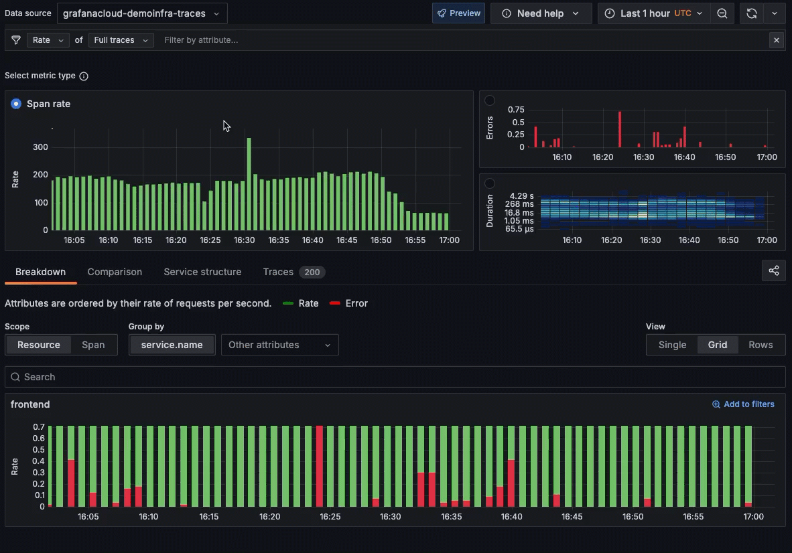
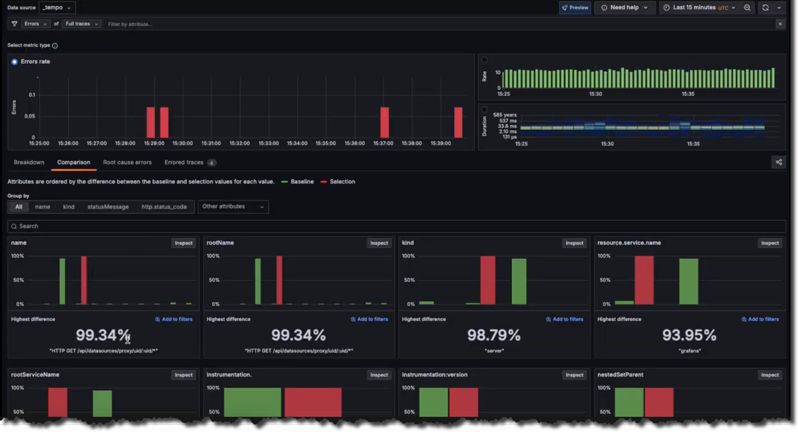
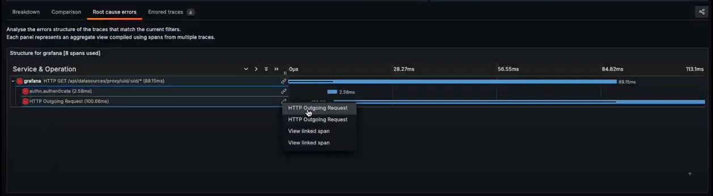
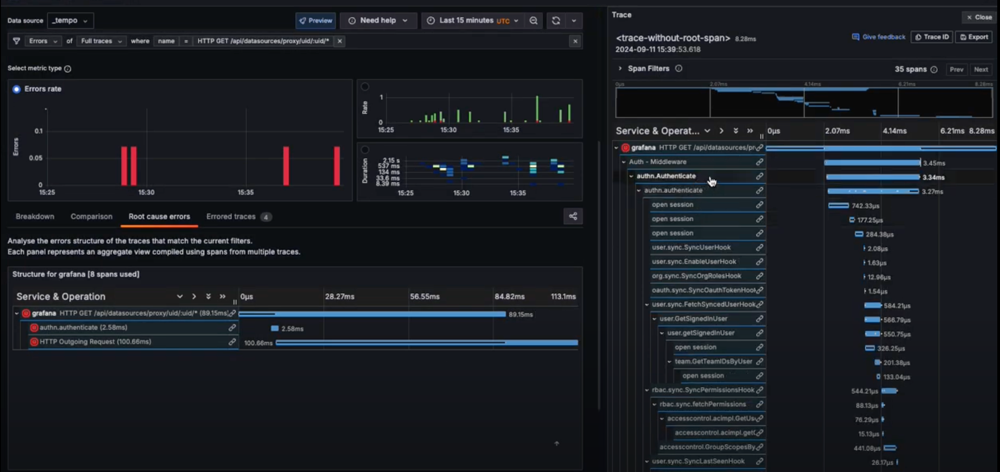

# Get started with Traces Drilldown



You can use traces to identify errors in your apps and services and then to optimize and streamline them.

When working with traces, start with the big picture.
Investigate using primary signals, RED metrics, filters, and structural or trace list tabs to explore your data.
To learn more, refer to [Concepts](../concepts/).


Expand your observability journey and learn about [the Drilldown apps suite](https://grafana.com/docs/grafana-cloud/visualizations/simplified-exploration/).




## Before you begin

To use Grafana Traces Drilldown with Grafana Cloud, you need:

- A Grafana Cloud account
- A Grafana stack in Grafana Cloud with a configured Tempo data source

To use Traces Drilldown with self-managed Grafana, you need:

- Your own Grafana v11.2 or later instance with a configured Tempo data source
- Installed Traces Drilldown plugin

For more details, refer to [Access Traces Drilldown](../access/).

## Explore your tracing data

Most investigations follow these steps:

1. Select the primary signal.
1. Choose the metric you want to use: rates, errors, or duration.
1. Define filters to refine the view of your data.
1. Use the structural or trace list to drill down into the issue.



## Example: Investigate source of errors

As an example, you want to uncover the source of errors in your spans.
For this, you need to compare the errors in the traces to locate the problem trace.
Here's how this works.

### Choose a signal type and metric

First, you select **Full traces** as the signal type, then choose the **Errors** metric.
Use **Full traces** to gain insight into the errors in the root of your traces or at the edge of your application.
If you're interested in any entrypoint to any service or **Database calls** (if you're concerned about databases), use the **Server spans** signal type.

### Correlate attributes

To correlate attribute values with errors, use the **Breakdown** tab.
This tab surfaces attributes values that heavily correlate with erroring spans.
The results are ordered by the difference in those attributes by the highest ones first. This helps
you see what's causing the errors immediately.
You can see here that 99.34% of the time the span name was equal to `HTTP GET /api/datasources/proxy/uid/:uid/*` the span was also erroring.

### Inspect the problem

To dig deeper, select **Inspect** to focus in on the problem.
It's easy to spot the problem: the tall, red bar indicates that the problems are happening with  `HTTP GET /api/datasources/proxy/uid/:uid/*`.
Next, use **Add to filters** to focus just on the erroring API call.

### Use Root cause errors

Select the **Root cause errors** tab for an aggregated view of all of the traces that have errors in them.
To view additional details, right-click on a line and select **HTTP Outgoing Request**.

To examine a single example transaction, click on an entry to open one of the individual traces used to construct that aggregate view.

