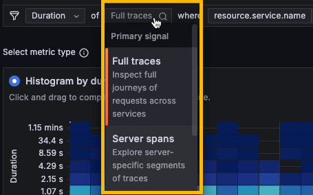
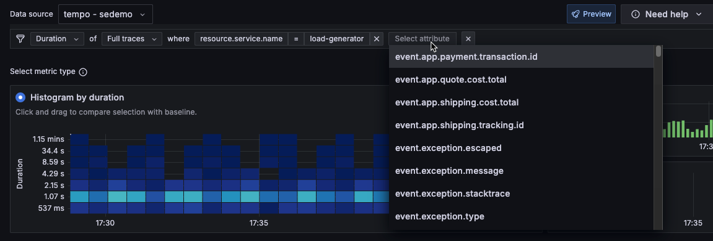

# Investigate trends and spikes



Grafana Traces Drilldown provides powerful tools that help you identify and analyze problems in your applications and services.

Using these steps, you can use the tracing data to investigate issues.

1. Select the primary signal.
1. Choose the metric you want to use: rates, errors, or duration.
1. Define filters to refine the view of your data.
1. Use the structural or trace list to drill down into the issue.



## Change the primary signal type to observe

Tracing data is highly structured and annotated and reflects events that happen in your services.
You can choose the type of services you want to observe and think about.

You can use the full trace (trace roots), or you can select a more specific type, such as service or database calls.

By default, Traces Drilldown displays information about full traces. You can change this by using the selector in the filter bar.

You can use any one of these primary signal types.

Full traces
: Inspect full journeys of requests across services

Server spans
: Explore service-specific segments of traces

Consumer spans
: Analyze how queues are consumed. A consumer span indicates an asynchronous handoff between services. These handoffs are almost always a queue.

Database calls
: Evaluate performance issues in database interactions

All spans
: View and analyze raw span data

## Choose a RED metric

Traces Drilldown uses RED metrics generated from your tracing data to guide your investigation.
In this context, RED metrics mean:

* **Rates** show the rate of incoming spans per second.
* **Errors** show spans that are failing.
* **Duration** displays the amount of time those spans take; represented as a heat map that shows response time and latency.

When you select a RED metric, the tabs underneath the metrics selection changes match the context.
For example, selecting **Duration** displays **Root cause latency** and **Slow traces tabs**.
Choosing **Errors** changes the tabs to **Root cause errors** and **Errored traces**. Rate provides **Service structure**, and **Traces** tabs.
These tabs are used when you [analyze tracing data](#analyze-tracing-data).

To choose a RED metric:

1. Select a graph to select a **Rate**, **Errors**, or **Duration** metric type. Notice that your selection changes the first drop-down list on the filter bar.
1. Optional: Select the signal you want to observe. **Full traces** are the default selection.
1. Look for spikes or trends in the data to help identify issues.


If no data or limited data appears, refresh the page. Verify that you have selected the correct data source in the Data source drop-down as well as a valid time range.


## Define filters

Next, refine your investigation by adding filters.

Filters are available on the **Breakdown** and **Comparison** tabs.

Each time you add a filter, the condition appears in the list of filters at the top of the page.
The list of filters expands as you investigate and explore your tracing data using Traces Drilldown.

1. Refine your investigation by adding filters.
1. Optional: Choose one of the attributes to group by or use **Search** to locate the service.
1. Optional: Use the tabs underneath the metrics selection to provide insights into breakdowns, comparisons, latency, and other explorations.
1. Choose filters to hone in on the problem areas. Each filter that you select adds to the **Filter** statement at the top of the page. You can select filters on the **Comparison** and **Breakdown** tabs in the following ways:
    * Select **Add to filters**.
    * Select **Inspect**.
    * Use the **Filter** bar near the top.

### Use the Breakdown tab

The **Breakdown** tab highlights attributes that are correlated with the selected metric.
When you're using **Duration** metrics, **Breakdown** orders the sequence of attributes by their average duration.
When you select **Rate**, **Breakdown** orders the sequence of attributes by their rate of requests per second, with errors colored red.

You can change the **Scope** to show **Resource** or **Span**.

Using the **Group by** selector, you can group the selected metric by different attributes.
For example, if you have selected **Errors** as a metric type and then choose the `service.name` attribute, the displayed results show the number of errors sorted by the `service.name` with the most matches.

The app defaults to `service.name` and displays other commonly used resource level attributes such as `cluster`, `environment`, and `namespace`.
In the drop-down list, you can choose any resource level attribute to group by.

### Modify a filter

Selecting an option for a filter automatically updates the displayed data.
If there are no matches, the app displays a “No data for selected query” message.

To modify an applied filter:

1. Select the filter to modify in the filter bar.
1. Select an option from the drop-down list.

You can also click in the **Filter** bar to add filters using drop-down lists.

### Remove filters

You can remove all or individual filters.

To remove a filter, select **Remove filter** (**X**) at the end of the filter you want to remove.

To remove all filters, select **Clear filters** (**X**) from the right side of the filter bar.

Selecting **Clear filters** resets your investigation back to the first metric you selected.
For example, if you selected Errors metrics and **Group by** the `host` service.name, selecting **Clear filters** resets the search back to just **Errors** selected as the metric type.

## Analyze tracing data

To further analyze the filtered spans, use the dynamically changing tabs, **Comparison**, **Structure** and **Trace list**.

When you select a RED metric, the tabs underneath the metrics selection changes match the context.

Each tab provides a brief explanation about the information provided.

### Comparison

The **Comparison** tab highlights attributes that are correlated with the selected metric.

The behavior of the comparison also differs depending upon the RED metric you've chosen.
For example, if you're viewing **Error** metrics, the comparison shows the attribute values that correlate with errors.
However, if you're viewing **Duration** metrics, the comparison shows the attributes that correlate with high latency.

### Structure

The structural tab lets you extract and view aggregate data from your traces.

* Rate provides **Service structure**
* Errors provides **Root cause errors**
* Duration metrics provides **Root cause latency**

For **Rate**, the **Service structure** tab shows you how your applications "talk" to each other to fulfill requests.
Use this tab to analyze the service structure of the traces that match the current filters.

For **Errors**, the **Root cause errors** tab shows structure of errors beneath your selected filters. Use this tab to immediately see the chain of errors that are causing issues higher up in traces.

When you select **Duration** metrics, the **Root cause latency** tab shows the structure of the longest running spans so you can analyze the structure of slow spans.

The pictured spans are an aggregated view compiled using spans from multiple traces.

### Trace list

Each RED metric has a trace list:

* **Rate** provides a tab that lists **Traces**.
* **Errors** provides a list of **Errored traces**.
* **Duration** lists **Slow traces**.

## Change selected time range

Use the time picker at the top right to modify the data shown in Traces Drilldown.

You can select a time range of up to 24 hours in duration.
This time range can be any 24-hour period in your configured trace data retention period.
The default is 30 days.

For more information about the time range picker, refer to [Use dashboards](https://grafana.com/docs/grafana/latest/dashboards/use-dashboards/#set-dashboard-time-range).

## View exemplars

An exemplar is a specific trace representative of measurement taken in a given time interval. While metrics excel at giving you an aggregated view of your system, traces give you a fine grained view of a single request; exemplars are a way to link the two.

Use exemplars to help isolate problems within your data distribution by pinpointing query traces exhibiting high latency within a time interval.
Once you localize the latency problem to a few exemplar traces, you can combine it with additional system based information or location properties to perform a root cause analysis faster, leading to quick resolutions to performance issues.

For more information, refer to [Introduction to exemplars](https://grafana.com/docs/grafana/<GRAFANA+VERSION>/fundamentals/exemplars/).

In Traces Drilldown, exemplar data is represented by a small diamond next to the bar graphs.
You can view the exemplar information by hovering the cursor over over the small diamond.

Select **View trace** to open a slide-out trace panel.

